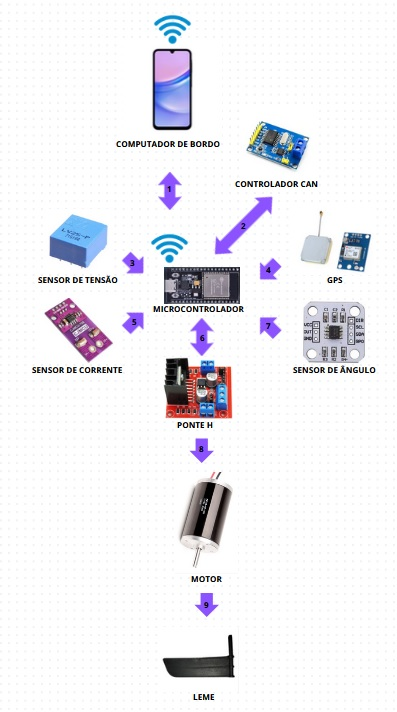

Diagrama de blocos preliminar do projeto:

legenda:

1. O computador de bordo envia a ângulação desejada e recebe as informações de telemetria via protocolo MQTT (tensão, corrente, potência, longitude, latitude, direção, velocidade, eventos).  
2. As mesmas informações de telemetria são fornecidas via protocolo CAN utilizado em veículos.  
3. A tensão de pico é medida na entrada do ponte H e enviada para o microcontrolador.  
4. As informações de geolocalização são enviadas para o microcontrolador.  
5. A corrente de pico é medida na entrada do ponte H e enviada para o microcontrolador.  
6. O PWM é gerado conforme o ângulo recebido pelo computador de bordo.  
7. O ângulo é medido sem contato no eixo do leme e enviado para o microcontrolador.  
8. O ponte H aciona o motor e fornece as proteções necessárias.  
9. O motor acoplado a um sistema de engrenagens e roldanas gira o leme na direção conforme o PWM.

